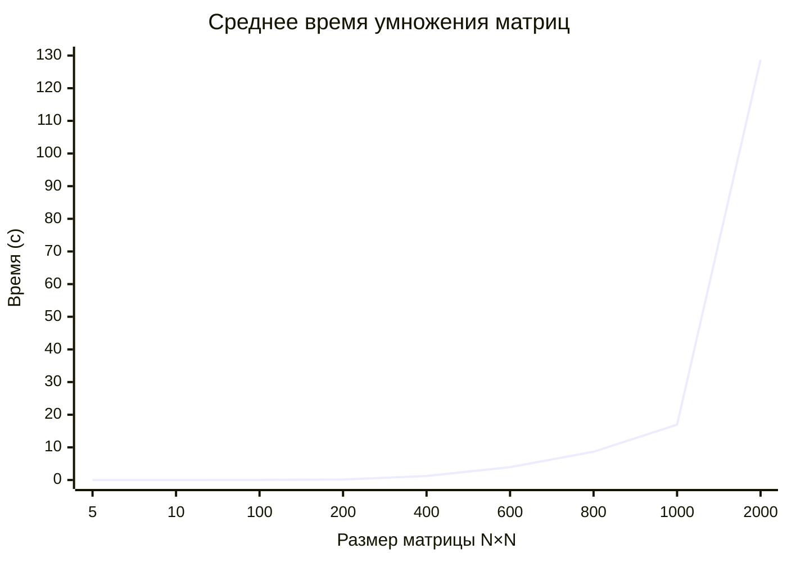
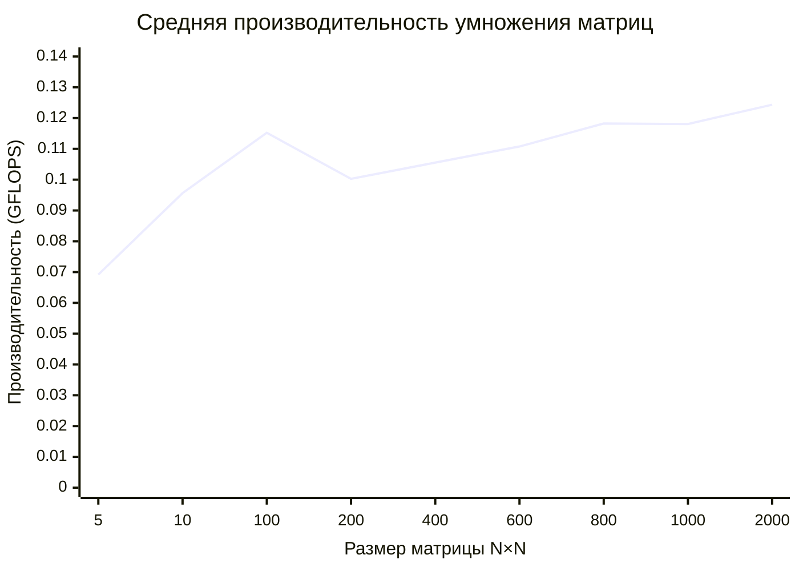

# Перемножение квадратных матриц на C++ с проверкой на Python

Программа на с++ для перемножения двух случайных квадратных матриц выбранного размера. Также реализована автоматическая проверка результата перемножения с помощью numpy.

Автор: Мошков Кирилл 6214

## Структура проекта
- [main.cpp](main.cpp) - основной код программы(В нём реализованы генерация файла с матрицей, чтение и сохранение в файл матриц).
- [check.py](check.py) - Скрипт для проверки верности перемножения матриц.
- [requirements.txt](requirements.txt) - список зависимостей для Python.

## Алгоритм
Перемножение в функции Multiply
```cpp
for (size_t i = 0; i < size; ++i) {
        for (size_t k = 0; k < size; ++k) {
            for (size_t j = 0; j < size; ++j) {
                result[i][j] += first[i][k] * second[k][j];
            }
        }
    }
```

## Результаты


| Размер матрицы (N×N) | Время умножения (с) | Количество операций (FLOP) | Производительность (GFLOPS) |
|---|---:|---:|---:|
| 5 × 5 | 0,000003 | 250 | 0,0872 |
| 5 × 5 | 0,000004 | 250 | 0,0595 |
| 5 × 5 | 0,000004 | 250 | 0,0609 |
| 10 × 10 | 0,000019 | 2000 | 0,1044 |
| 10 × 10 | 0,000029 | 2000 | 0,0690 |
| 10 × 10 | 0,000018 | 2000 | 0,1135 |
| 100 × 100 | 0,017746 | 2000000 | 0,1127 |
| 100 × 100 | 0,017018 | 2000000 | 0,1175 |
| 100 × 100 | 0,017316 | 2000000 | 0,1155 |
| 200 × 200 | 0,148616 | 16000000 | 0,1077 |
| 200 × 200 | 0,167572 | 16000000 | 0,0955 |
| 200 × 200 | 0,163856 | 16000000 | 0,0976 |
| 400 × 400 | 1,321175 | 128000000 | 0,0969 |
| 400 × 400 | 1,084039 | 128000000 | 0,1181 |
| 400 × 400 | 1,259234 | 128000000 | 0,1016 |
| 600 × 600 | 3,566525 | 432000000 | 0,1211 |
| 600 × 600 | 4,363616 | 432000000 | 0,0990 |
| 600 × 600 | 3,849262 | 432000000 | 0,1122 |
| 800 × 800 | 8,389620 | 1024000000 | 0,1221 |
| 800 × 800 | 8,645599 | 1024000000 | 0,1184 |
| 800 × 800 | 8,965647 | 1024000000 | 0,1142 |
| 1000 × 1000 | 16,818323 | 2000000000 | 0,1189 |
| 1000 × 1000 | 17,485014 | 2000000000 | 0,1144 |
| 1000 × 1000 | 16,536419 | 2000000000 | 0,1209 |
| 2000 × 2000 | 129,275542 | 16000000000 | 0,1238 |
| 2000 × 2000 | 128,567812 | 16000000000 | 0,1244 |
| 2000 × 2000 | 128,248427 | 16000000000 | 0,1248 |

### СРЕДНЕЕ

| Размер матрицы (N×N) | Время умножения (с) | Количество операций (FLOP) | Производительность (GFLOPS) |
|---|---:|---:|---:|
| 5 × 5 | 0,000004 | 250 | 0,069200 |
| 10 × 10 | 0,000022 | 2000 | 0,095633 |
| 100 × 100 | 0,017360 | 2000000 | 0,115233 |
| 200 × 200 | 0,160015 | 16000000 | 0,100267 |
| 400 × 400 | 1,221483 | 128000000 | 0,105533 |
| 600 × 600 | 3,926468 | 432000000 | 0,110767 |
| 800 × 800 | 8,666955 | 1024000000 | 0,118233 |
| 1000 × 1000 | 16,946585 | 2000000000 | 0,118067 |
| 2000 × 2000 | 128,697260 | 16000000000 | 0,124333 |




Исходные данные находятся в [data.ods](data.ods)
## Вывод

- При увеличении размера матрицы время выполнения заметно возрастает. Для матрицы 100×100 среднее время составляет 0,017360 с, а для 2000×2000 - уже 128,697260 с.
- Рост времени выполнения соответствует кубической сложности алгоритма умножения матриц O(N³). При увеличении размера матрицы в 2 раза количество операций увеличивается примерно в 8 раз.
- Средняя производительность изменяется незначительно: для матриц от 100×100 до 2000×2000 она находится в диапазоне примерно 0,100-0,124 GFLOPS. При этом наибольшее значение в измерениях получено для матрицы 2000×2000 - 0,124333 GFLOPS.

