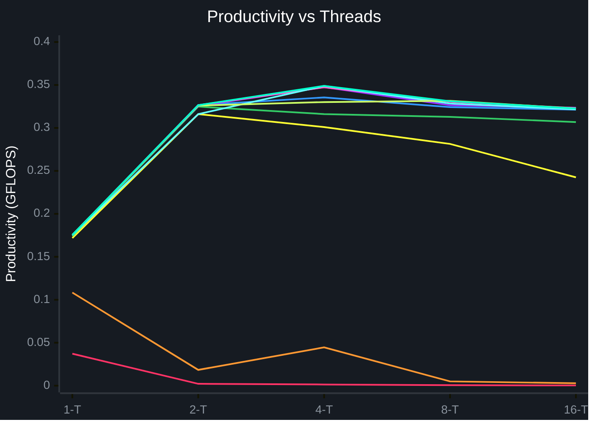

# Лабораторная работа №2
Программа на C++ для параллельного перемножения двух квадратных матриц выбранного размера по технологии OpenMP.

**Автор:** Мошков Кирилл

---

## Структура проекта
- [main.cpp](main.cpp) - основной код программы(В нём реализованы генерация файла с матрицей, чтение и сохранение в файл) матриц).
- [check.py](check.py) - Скрипт для проверки верности перемножения матриц.
- [requirements.txt](requirements.txt) - список зависимостей для Python.
- [test_data.sh](test_data.sh) - bash-скрипт для сбора данных для статистики

---

## Алгоритм
```cpp
#pragma omp parallel for shared(first, second, result)
for (size_t i = 0; i < size; ++i) {
    for (size_t k = 0; k < size; ++k) {
        double a = first[i][k];
        for (size_t j = 0; j < size; ++j) {
            result[i][j] += a * second[k][j];
        }
    }
}
```

---
## Сбор статистики
Я решил взять 10 различных размеров матриц
(5 10 100 200 400 600 800 1000 1600 2000)

Различное количество потоков(1 2 4 8 16)

И по 3 вычисления на каждую комбинацию размера матрицы и количества потоков

В README в таблице приведены только средние значения, исходные данные находятся в [data.ods](data.ods)

Для ускорения сбора данных, я написал bash-скрипт [test_data.sh](test_data.sh), который запускает программу с разными значениями и результат направляет в таблицу исходных данных

---

## Конфигурация стенда
Тестирование проводилось на процессоре с **4 ядрами**. Из-за этого при запуске тестов на 8 и 16 потоках наблюдается закономерное падение производительности.

---

## Результаты
Здесь представлены средние значения для всех запусков программы, сами исходные данные находятся в [data.ods](data.ods)

| Размер матрицы (N×N) | Количество потоков | Время умножения (с) | Количество операций (FLOP) | Производительность (GFLOPS) |
| :---: | :---: | :---: | :---: | :---: |
| **5** | 1 | 0,000008 | 250 | 0,0372 |
| | 2 | 0,000116 | 250 | 0,0022 |
| | 4 | 0,000175 | 250 | 0,0014 |
| | 8 | 0,000429 | 250 | 0,0006 |
| | 16 | 0,000702 | 250 | 0,0003 |
| **10** | 1 | 0,000018 | 2000 | 0,1084 |
| | 2 | 0,000109 | 2000 | 0,0184 |
| | 4 | 0,000178 | 2000 | 0,0446 |
| | 8 | 0,000404 | 2000 | 0,0050 |
| | 16 | 0,000705 | 2000 | 0,0028 |
| **100** | 1 | 0,011634 | 2000000 | 0,1719 |
| | 2 | 0,006326 | 2000000 | 0,3161 |
| | 4 | 0,006646 | 2000000 | 0,3010 |
| | 8 | 0,007155 | 2000000 | 0,2814 |
| | 16 | 0,008403 | 2000000 | 0,2425 |
| **200** | 1 | 0,091872 | 16000000 | 0,1741 |
| | 2 | 0,049257 | 16000000 | 0,3248 |
| | 4 | 0,050624 | 16000000 | 0,3161 |
| | 8 | 0,051229 | 16000000 | 0,3129 |
| | 16 | 0,052168 | 16000000 | 0,3068 |
| **400** | 1 | 0,729418 | 128000000 | 0,1755 |
| | 2 | 0,391916 | 128000000 | 0,3266 |
| | 4 | 0,381842 | 128000000 | 0,3355 |
| | 8 | 0,394850 | 128000000 | 0,3242 |
| | 16 | 0,398306 | 128000000 | 0,3213 |
| **600** | 1 | 2,462971 | 432000000 | 0,1754 |
| | 2 | 1,326661 | 432000000 | 0,3256 |
| | 4 | 1,242999 | 432000000 | 0,3475 |
| | 8 | 1,323826 | 432000000 | 0,3264 |
| | 16 | 1,335418 | 432000000 | 0,3235 |
| **800** | 1 | 5,840155 | 1024000000 | 0,1753 |
| | 2 | 3,135953 | 1024000000 | 0,3265 |
| | 4 | 2,948556 | 1024000000 | 0,3473 |
| | 8 | 3,098937 | 1024000000 | 0,3304 |
| | 16 | 3,168582 | 1024000000 | 0,3232 |
| **1000** | 1 | 11,421611 | 2000000000 | 0,1751 |
| | 2 | 6,339048 | 2000000000 | 0,3161 |
| | 4 | 5,731519 | 2000000000 | 0,3489 |
| | 8 | 6,091534 | 2000000000 | 0,3284 |
| | 16 | 6,218363 | 2000000000 | 0,3216 |
| **1600** | 1 | 46,661537 | 8192000000 | 0,1755 |
| | 2 | 25,132740 | 8192000000 | 0,3260 |
| | 4 | 24,935285 | 8192000000 | 0,3301 |
| | 8 | 24,702248 | 8192000000 | 0,3316 |
| | 16 | 25,392857 | 8192000000 | 0,3226 |
| **2000** | 1 | 91,182165 | 16000000000 | 0,1755 |
| | 2 | 49,005048 | 16000000000 | 0,3265 |
| | 4 | 45,837579 | 16000000000 | 0,3490 |
| | 8 | 48,318547 | 16000000000 | 0,3311 |
| | 16 | 49,596004 | 16000000000 | 0,3226 |

---

### Зависимость производительности от числа потоков



* 🔴 Матрица 5 x 5
* 🟠 Матрица 10 x 10
* 🟡 Матрица 100 x 100
* 🟢 Матрица 200 x 200
* 🔵 Матрица 400 x 400
* 🟣 Матрица 600 x 600
* ⚫ Матрица 800 x 800
* ⚪ Матрица 1000 x 1000
* 🟤 Матрица 1600 x 1600
* 🟦 Матрица 2000 x 2000
 
 ---
 
## Вывод

1. **Зависимость от объема данных и кубическая сложность $O(N^3)$:** При фиксированном числе потоков увеличение размера матрицы приводит к кубическому росту времени выполнения (аналогично первой лабораторной работе). Так, для однопоточного режима время выполнения на матрице 100×100 составляет всего **0.011634 с**, тогда как на матрице 2000×2000 оно возрастает до **91.182165 с**, что наглядно подтверждает теоретическую сложность алгоритма.
2. **Эффективность распараллеливания и пиковая производительность:** Интеграция технологии OpenMP позволила существенно сократить временные затраты на обработку больших массивов данных. В отличие от однопоточного режима, где производительность держится строго в районе **0.17 GFLOPS**, параллельные конфигурации демонстрируют стабильный скачок скорости. Абсолютный пик производительности достигнут на матрице размера 2000×2000 при работе в 4 потока и составил **0.3490 GFLOPS** (что почти в 2 раза быстрее последовательного выполнения).
3. **Влияние накладных расходов на малых масштабах:** На сверхмалых объемах данных (матрицы 5×5 и 10×10) параллельные потоки наносят серьезный ущерб общей скорости. С ростом числа потоков от 1 до 16 производительность для матрицы 5×5 падает с **0.0372 GFLOPS** практически до нуля (**0.0003 GFLOPS**). Это обусловлено тем, что временные затраты операционной системы на инициализацию, распределение задач и синхронизацию потоков многократно превышают время вычисления самой микроматрицы.
